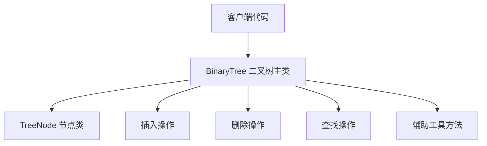
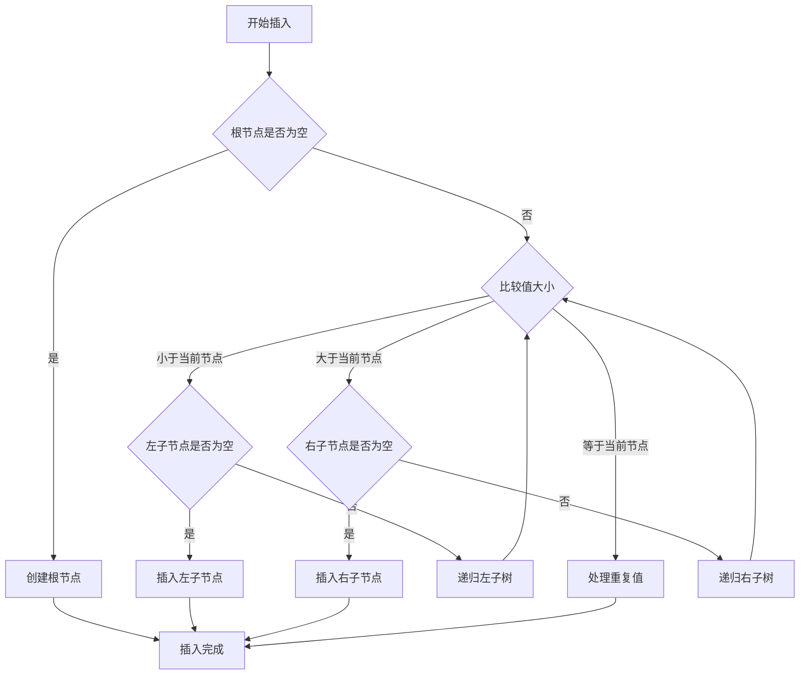
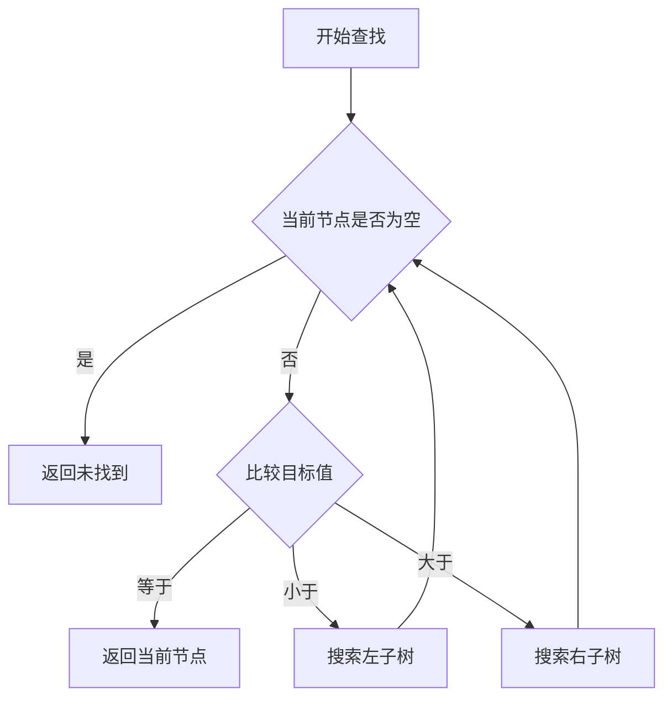
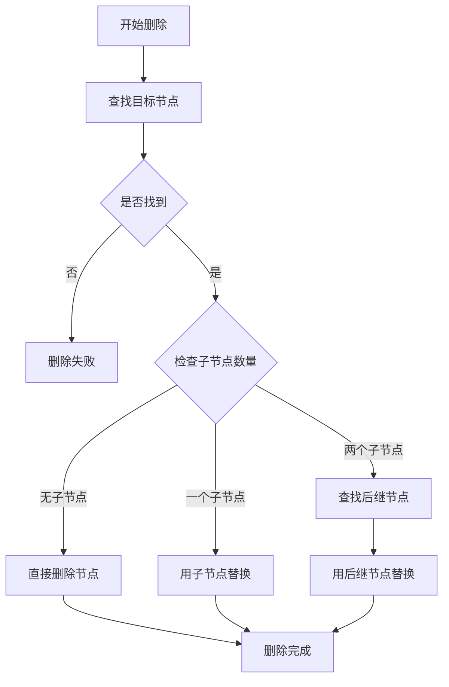
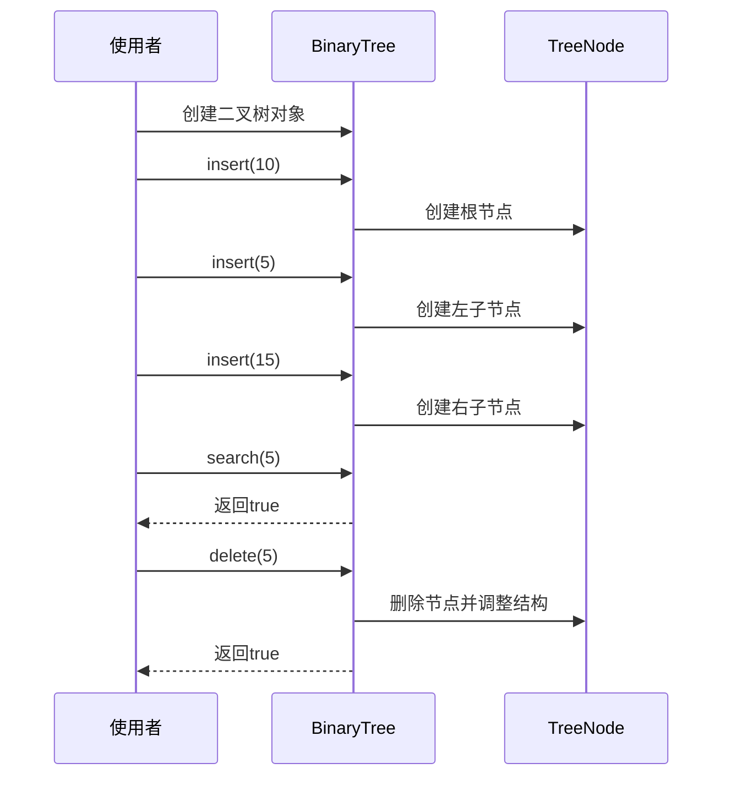

# 二叉树算法程序设计文档

## 1. 概述

### 1.1 设计目标
设计并实现一个Java二叉树算法程序，提供基础的二叉树操作功能，包括节点的插入、删除、查找等核心操作。该程序旨在作为学习和演示二叉树数据结构及其基本算法的工具。

### 1.2 适用范围
本设计适用于学习二叉树数据结构的场景，提供清晰的算法实现和易于理解的代码结构。

### 1.3 设计原则
- 简洁性: 代码结构清晰，易于理解和维护
- 可扩展性: 预留扩展接口，便于后续添加新功能
- 正确性: 确保算法实现的正确性和边界条件处理
- 可读性: 提供充分的注释和文档说明

## 2. 系统架构

### 2.1 整体架构



### 2.2 核心组件说明

| 组件名称 | 职责描述 |
|---------|---------|
| TreeNode | 表示二叉树的节点，包含数据域和左右子节点引用 |
| BinaryTree | 二叉树主类，封装树的根节点和各种操作方法 |
| 插入操作模块 | 负责向二叉树中插入新节点 |
| 删除操作模块 | 负责从二叉树中删除指定节点 |
| 查找操作模块 | 负责在二叉树中查找指定值的节点 |
| 辅助工具模块 | 提供树的打印、高度计算等辅助功能 |

## 3. 数据模型设计

### 3.1 节点数据结构

| 属性名称 | 数据类型 | 说明 |
|---------|---------|------|
| value | int | 节点存储的数据值 |
| left | TreeNode | 左子节点引用 |
| right | TreeNode | 右子节点引用 |

### 3.2 二叉树结构

| 属性名称 | 数据类型 | 说明 |
|---------|---------|------|
| root | TreeNode | 树的根节点引用 |

## 4. 核心功能设计

### 4.1 节点插入功能

#### 4.1.1 功能描述
向二叉树中插入新节点。对于二叉搜索树(BST)实现，遵循左子树所有节点值小于根节点，右子树所有节点值大于根节点的规则。

#### 4.1.2 操作流程



#### 4.1.3 算法策略
- 采用递归或迭代方式实现
- 对于BST实现，按照值的大小决定插入位置
- 处理重复值的策略:可以忽略、更新或插入到右子树

### 4.2 节点查找功能

#### 4.2.1 功能描述
在二叉树中查找指定值的节点，返回该节点的引用或标识是否存在。

#### 4.2.2 操作流程



#### 4.2.3 算法策略
- 从根节点开始比较
- 根据值的大小关系决定搜索方向
- 返回布尔值或节点引用

### 4.3 节点删除功能

#### 4.3.1 功能描述
从二叉树中删除指定值的节点，并保持树的结构性质。

#### 4.3.2 操作流程



#### 4.3.3 删除场景处理

| 场景 | 处理策略 |
|-----|---------|
| 删除叶子节点 | 直接将父节点的对应引用设为空 |
| 删除只有一个子节点的节点 | 用其唯一子节点替换该节点 |
| 删除有两个子节点的节点 | 找到右子树中的最小节点(中序后继)或左子树中的最大节点(中序前驱)替换 |

### 4.4 辅助功能

#### 4.4.1 树的遍历
虽然不是主要功能，但提供基础的遍历方法用于验证和调试:
- 中序遍历: 验证BST的有序性
- 前序遍历: 用于树的复制
- 后序遍历: 用于树的销毁

#### 4.4.2 树的属性计算
- 计算树的高度
- 计算节点总数
- 判断树是否为空

#### 4.4.3 树的可视化打印
提供简单的控制台输出方法，以可视化方式展示树的结构，便于调试和演示。

## 5. 接口设计

### 5.1 BinaryTree 类公共接口

| 方法名称 | 参数 | 返回值 | 功能描述 |
|---------|------|--------|---------|
| insert | int value | void | 插入新节点 |
| delete | int value | boolean | 删除指定值的节点，返回是否成功 |
| search | int value | boolean | 查找指定值是否存在 |
| findNode | int value | TreeNode | 查找并返回指定值的节点 |
| getHeight | 无 | int | 获取树的高度 |
| getSize | 无 | int | 获取节点总数 |
| isEmpty | 无 | boolean | 判断树是否为空 |
| printTree | 无 | void | 打印树结构 |
| clear | 无 | void | 清空树 |

### 5.2 TreeNode 类结构

| 方法名称 | 参数 | 返回值 | 功能描述 |
|---------|------|--------|---------|
| TreeNode构造器 | int value | - | 创建新节点 |
| getValue | 无 | int | 获取节点值 |
| setValue | int value | void | 设置节点值 |
| getLeft | 无 | TreeNode | 获取左子节点 |
| setLeft | TreeNode left | void | 设置左子节点 |
| getRight | 无 | TreeNode | 获取右子节点 |
| setRight | TreeNode right | void | 设置右子节点 |

## 6. 异常处理策略

### 6.1 异常场景识别

| 异常场景 | 处理策略 |
|---------|---------|
| 空树操作 | 插入时创建根节点，删除和查找时返回失败标识 |
| 重复值插入 | 忽略重复插入或更新节点 |
| 删除不存在的节点 | 返回false或抛出自定义异常 |
| 空指针访问 | 在所有节点操作前进行空值检查 |

### 6.2 边界条件处理
- 空树的各种操作
- 只有根节点的树的删除操作
- 单侧子树的情况
- 最大高度和最小高度的情况

## 7. 项目结构设计

### 7.1 包结构

```
com.square.binarytree
├── TreeNode.java          # 节点类
├── BinaryTree.java        # 二叉树主类
├── BinarySearchTree.java  # 二叉搜索树实现
└── Main.java              # 示例主程序
```

### 7.2 文件组织
- 所有类放置在统一的包下
- 每个类职责单一，便于理解和测试
- 主程序提供使用示例

## 8. 测试策略

### 8.1 测试范围

| 测试类型 | 测试内容 |
|---------|---------|
| 功能测试 | 验证插入、删除、查找的正确性 |
| 边界测试 | 测试空树、单节点、极端值等边界情况 |
| 场景测试 | 测试各种删除场景(叶子节点、单子节点、双子节点) |
| 顺序测试 | 测试有序插入、无序插入的结果 |

### 8.2 测试用例设计要点
- 测试空树的各种操作
- 测试单个节点的插入和删除
- 测试批量插入后的树结构正确性
- 测试删除各种类型节点后的树结构
- 测试查找存在和不存在的值
- 验证BST的有序性(通过中序遍历)

## 9. 性能考虑

### 9.1 时间复杂度分析

| 操作 | 平均情况 | 最坏情况 | 说明 |
|------|---------|---------|------|
| 插入 | O(log n) | O(n) | 平衡树为O(log n)，退化为链表时为O(n) |
| 删除 | O(log n) | O(n) | 同插入 |
| 查找 | O(log n) | O(n) | 同插入 |

### 9.2 空间复杂度
- 节点存储: O(n)，n为节点总数
- 递归调用栈: O(h)，h为树的高度

### 9.3 优化建议
- 对于学习目的，优先保证代码清晰度
- 可以在注释中说明如何优化为平衡树
- 提供迭代版本以避免递归调用栈开销

## 10. 扩展性设计

### 10.1 预留扩展点
- 支持泛型，不仅限于int类型
- 支持自定义比较器
- 扩展为平衡二叉树(AVL树、红黑树)
- 添加更多遍历方式(层序遍历)
- 支持树的序列化和反序列化

### 10.2 未来功能方向
- 可视化图形界面展示
- 性能统计和分析
- 持久化存储支持
- 多种二叉树类型的统一接口

## 11. 使用示例说明

### 11.1 基本使用流程



### 11.2 典型使用场景
- 创建树并插入多个节点
- 查找特定值是否存在
- 删除指定节点
- 打印树结构验证正确性
- 获取树的属性信息(高度、大小等)

## 12. 质量保证

### 12.1 代码规范
- 遵循Java命名规范
- 每个方法提供清晰的注释
- 关键算法步骤添加行内注释
- 使用有意义的变量名

### 12.2 文档要求
- 每个类提供类级别的Javadoc注释
- 公共方法提供完整的方法注释
- 说明参数、返回值和可能的异常
- 提供使用示例

### 12.3 验收标准
- 所有基本操作功能正常
- 边界条件处理正确
- 代码结构清晰易懂
- 提供可运行的示例程序
- 通过基本的功能测试
