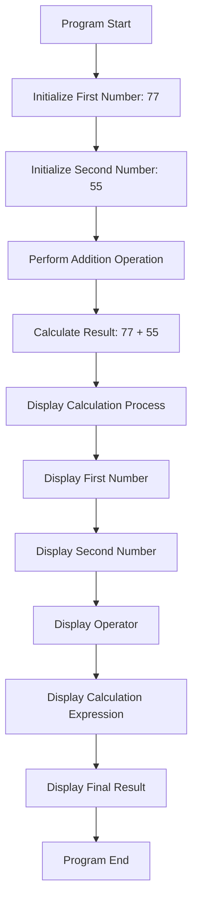

# Calculate Sum Feature Design

## Overview

This design document describes a sum calculation feature in Java that adds two numbers together. The feature will follow the existing calculator pattern in the codebase (similar to Addition.java and AdditionCalculator.java) and provide a reusable, well-structured solution for addition operations.

## Objectives

- Create a Java component that calculates the sum of two numbers
- Support integer arithmetic operations
- Provide clear output showing the calculation process and result
- Follow the existing code structure and naming conventions in the com.square package
- Enable easy testing and validation

## Functional Requirements

### Core Functionality

The system must perform the following operations:

1. Accept two integer numbers as input (e.g., 77 and 55)
2. Execute the addition operation
3. Display the calculation process including:
   - First operand
   - Second operand
   - Operator symbol (+)
   - Calculation expression
   - Final result

### Input Specifications

| Parameter | Type | Description | Constraints |
|-----------|------|-------------|-------------|
| First Number | int | The first operand in the addition | Standard Java int range (-2,147,483,648 to 2,147,483,647) |
| Second Number | int | The second operand in the addition | Standard Java int range (-2,147,483,648 to 2,147,483,647) |

### Output Specifications

The system will output formatted text to the console displaying:

| Output Element | Description | Example |
|----------------|-------------|---------|
| Calculation Process Label | Header indicating calculation details | "计算过程:" |
| First Number Display | Shows the first operand | "第一个数: 77" |
| Second Number Display | Shows the second operand | "第二个数: 55" |
| Operator Display | Shows the operation symbol | "运算符: +" |
| Calculation Expression | Shows the complete calculation | "计算: 77 + 55 = 132" |
| Final Result | Shows the result value | "最终结果: 132" |

### Example Usage

For the input values 77 and 55, the expected output would be:

```
计算过程:
第一个数: 77
第二个数: 55
运算符: +
计算: 77 + 55 = 132
最终结果: 132
```

## Design Approach

### Architectural Alignment

The implementation will align with the existing calculator components in the com.square package, maintaining consistency with:

- Addition.java (hardcoded values approach)
- AdditionCalculator.java (constant-based approach with documentation)

### Component Structure

The sum calculator will be organized as follows:

**Package**: com.square

**Class Name**: SumCalculator (or similar, following existing conventions)

**Key Elements**:

1. **Constants Section**: Define the two numbers to be added as named constants for clarity and maintainability
2. **Main Method**: Entry point that orchestrates the calculation and output
3. **Calculation Logic**: Simple addition operation
4. **Output Formatting**: Structured console output matching the existing pattern

### Calculation Flow



## Non-Functional Requirements

### Code Quality

- Follow Java coding conventions and best practices
- Include appropriate documentation comments (Javadoc style)
- Use meaningful variable and constant names
- Maintain code readability and simplicity

### Maintainability

- Use constants for numeric values to facilitate easy modification
- Structure the code to allow straightforward updates to input values
- Follow the existing pattern established by other calculator classes in the package

### Documentation

- Include class-level Javadoc describing the purpose and functionality
- Document the main method with parameter and behavior descriptions
- Add inline comments where necessary for clarity

### Output Format

- Ensure console output is clear and properly formatted
- Use consistent indentation and spacing
- Display information in a logical sequence

## Technical Specifications

### Programming Language

- Java (version compatible with existing project setup)

### Package Structure

- Package: com.square
- Location: src/main/java/com/square/

### Dependencies

- Standard Java libraries only (no external dependencies required)
- Java SE core classes (System, PrintStream)

### Execution Environment

- Standalone Java application
- Executed via main method
- Console-based output

## Validation and Testing

### Test Cases

| Test Case | First Number | Second Number | Expected Result | Purpose |
|-----------|--------------|---------------|-----------------|---------|
| TC-01 | 77 | 55 | 132 | Validate primary use case |
| TC-02 | 0 | 0 | 0 | Test zero values |
| TC-03 | -10 | 20 | 10 | Test negative numbers |
| TC-04 | 1000000 | 2000000 | 3000000 | Test large numbers |

### Validation Criteria

The implementation is considered successful when:

1. The program compiles without errors
2. The output format matches the specified structure
3. The calculation result is mathematically correct
4. The code follows existing conventions in the com.square package
5. All test cases produce expected results

### Manual Testing

Execute the program and verify:

- Output appears in the correct sequence
- All labels are properly displayed in Chinese characters
- Numeric values are accurate
- Formatting is clean and readable

## Future Enhancements

Potential improvements that could be considered in future iterations:

1. **User Input**: Accept numbers from command-line arguments or console input instead of hardcoded values
2. **Multiple Operations**: Support subtraction, multiplication, and division
3. **Overflow Handling**: Add validation for arithmetic overflow conditions
4. **Floating-Point Support**: Extend to support double or BigDecimal for decimal calculations
5. **Batch Calculations**: Process multiple calculation pairs in sequence
6. **Result Storage**: Save calculation history to a file or database

## Constraints and Assumptions

### Assumptions

- The program will be executed in an environment with proper Java runtime
- Console output supports Chinese character encoding (UTF-8)
- Input values are within the standard Java int range
- No concurrent execution requirements

### Constraints

- Limited to integer arithmetic (no decimal support in initial version)
- No external configuration or input files
- Console-based interface only
- Single-threaded execution model

### Known Limitations

- Integer overflow is not explicitly handled (relies on Java's default behavior)
- No error recovery mechanisms for runtime exceptions
- Output language is fixed to Chinese (no internationalization)

## Success Criteria

The feature will be considered complete and successful when:

1. A working Java class is created in the com.square package
2. The program correctly calculates 77 + 55 = 132
3. Output formatting matches the specified template
4. Code quality meets the project standards
5. The implementation is consistent with existing calculator classes
6. Manual testing confirms all outputs are correct
