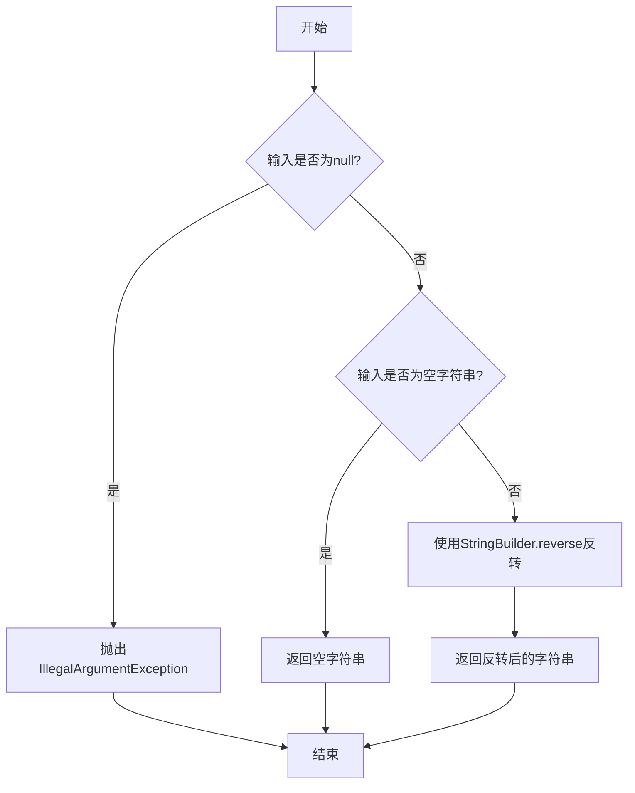

# 字符反转功能设计文档

## 1. 需求概述

### 1.1 业务目标
实现一个字符反转功能，能够将输入的字符串"123654"反转为"456321"，并提供通用的字符串反转能力。

### 1.2 功能范围
- 支持任意字符串的反转操作
- 支持数字字符串、英文字符、中文字符及特殊字符
- 提供异常处理机制确保系统稳定性

## 2. 功能设计

### 2.1 核心功能模块

#### 字符串反转模块
负责执行字符串的反转操作，将输入字符串的字符顺序完全颠倒。

**输入要求**
- 接受字符串类型参数
- 不接受null值

**输出说明**
- 返回反转后的字符串
- 空字符串返回空字符串
- 单字符返回原字符

**异常处理**
- 当输入为null时抛出参数非法异常

### 2.2 反转策略

采用StringBuilder反转方法实现字符串反转，该方法具有以下优势：
- 高效：内置方法经过优化，性能良好
- 简洁：代码清晰易维护
- 可靠：经过充分测试，稳定性高

### 2.3 功能流程

## 3. 数据模型

### 3.1 输入输出模型

| 数据项 | 类型 | 说明 | 约束 |
|--------|------|------|------|
| 输入字符串 | String | 待反转的字符串 | 不能为null |
| 输出字符串 | String | 反转后的字符串 | 与输入长度相同 |

### 3.2 示例数据

| 输入示例 | 输出示例 | 说明 |
|----------|----------|------|
| "123654" | "456321" | 数字字符串反转 |
| "Hello" | "olleH" | 英文字符串反转 |
| "你好" | "好你" | 中文字符串反转 |
| "" | "" | 空字符串处理 |
| "A" | "A" | 单字符处理 |

## 4. 接口设计

### 4.1 核心方法接口

**方法签名**
- 方法名称：reverseString
- 访问修饰符：public static
- 返回类型：String
- 参数列表：String input

**方法职责**
- 接收字符串参数
- 验证参数有效性
- 执行反转操作
- 返回反转结果

**异常规范**
- IllegalArgumentException：当输入参数为null时抛出

### 4.2 接口约定

| 项目 | 说明 |
|------|------|
| 方法可见性 | 公开静态方法，可直接调用 |
| 线程安全性 | 方法无状态，线程安全 |
| 性能要求 | 时间复杂度O(n)，空间复杂度O(n) |
| 幂等性 | 两次反转恢复原值 |

## 5. 异常处理策略

### 5.1 异常分类

| 异常类型 | 触发条件 | 处理方式 |
|----------|----------|----------|
| IllegalArgumentException | 输入参数为null | 立即抛出，提示调用方 |

### 5.2 异常处理原则
- 快速失败：在方法入口处进行参数校验
- 明确提示：异常信息清晰说明错误原因
- 调用方责任：由调用方处理异常情况

## 6. 测试策略

### 6.1 测试场景覆盖

| 测试场景 | 测试目的 | 验证点 |
|----------|----------|--------|
| 数字字符串反转 | 验证目标需求"123654" | 输出"456321" |
| 英文字符串反转 | 验证基本字母处理 | 字符顺序正确颠倒 |
| 中文字符串反转 | 验证多字节字符处理 | Unicode字符正确反转 |
| 空字符串反转 | 验证边界条件 | 返回空字符串 |
| 单字符反转 | 验证最小输入 | 返回原字符 |
| null输入测试 | 验证异常处理 | 抛出IllegalArgumentException |
| 特殊字符反转 | 验证符号处理 | 特殊符号正确反转 |
| 混合字符串反转 | 验证综合场景 | 各类字符混合正确处理 |

### 6.2 测试方法
- 单元测试：使用JUnit 5框架编写测试用例
- 断言验证：使用assertEquals验证期望输出
- 异常测试：使用assertThrows验证异常抛出

## 7. 非功能性需求

### 7.1 性能要求
- 响应时间：反转操作应在毫秒级完成
- 资源消耗：内存占用与字符串长度成正比
- 可扩展性：支持任意长度字符串（受JVM内存限制）

### 7.2 可维护性要求
- 代码清晰：方法职责单一，逻辑简洁
- 文档完善：提供Javadoc注释说明
- 易于测试：方法无副作用，便于单元测试

### 7.3 兼容性要求
- Java版本：支持Java 8及以上版本
- 字符编码：支持UTF-8编码，正确处理多字节字符

## 8. 部署说明

### 8.1 打包方式
作为工具类方法，集成在com.square包中，随项目一起编译打包。

### 8.2 依赖关系
- 核心依赖：Java标准库（StringBuilder）
- 测试依赖：JUnit 5测试框架

### 8.3 运行方式
提供两种使用方式：
- 作为工具方法：在其他类中直接调用reverseString静态方法
- 独立运行：通过main方法启动交互式命令行程序
