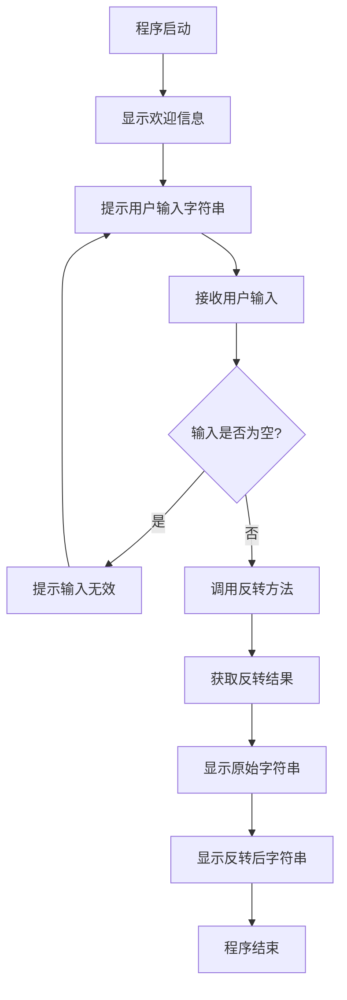

# 字符反转程序设计文档

## 需求概述

设计并实现一个Java字符反转程序，能够接收用户输入的字符串，并将其反转后输出。

## 功能需求

### 核心功能

| 功能项 | 功能描述 | 优先级 |
|--------|----------|--------|
| 字符串反转 | 接收用户输入的字符串，将字符顺序反转后输出 | 高 |
| 交互式输入 | 通过控制台提供友好的用户交互界面 | 高 |
| 结果展示 | 清晰展示原始字符串和反转后的结果 | 高 |

### 功能范围

支持反转包含以下内容的字符串：
- 英文字母（大小写）
- 数字
- 中文字符
- 特殊符号
- 空格

## 系统架构设计

### 整体结构

系统采用简单的单类设计，包含字符串反转的核心逻辑和用户交互功能。

### 组件划分

| 组件名称 | 职责描述 |
|----------|----------|
| 主程序类 | 负责程序入口、用户交互和流程控制 |
| 反转方法 | 实现字符串反转的核心算法逻辑 |

## 核心逻辑设计

### 字符串反转算法

提供多种字符串反转实现方式供选择：

| 算法方案 | 实现思路 | 时间复杂度 | 空间复杂度 |
|----------|----------|------------|------------|
| 方案一：字符数组双指针 | 将字符串转换为字符数组，使用双指针从两端向中间交换字符 | O(n) | O(n) |
| 方案二：StringBuilder反转 | 使用StringBuilder内置的reverse方法 | O(n) | O(n) |
| 方案三：递归反转 | 通过递归方式逐字符拼接实现反转 | O(n) | O(n) |

推荐使用方案二，因为其简洁且性能优秀。

### 程序执行流程



## 接口设计

### 公共方法定义

| 方法签名 | 参数说明 | 返回值说明 | 功能描述 |
|----------|----------|------------|----------|
| main(String[] args) | args: 命令行参数（可选） | 无返回值 | 程序主入口，负责用户交互流程 |
| reverseString(String input) | input: 待反转的字符串 | 反转后的字符串 | 执行字符串反转操作 |

## 数据模型

### 输入数据

| 数据项 | 数据类型 | 说明 | 示例 |
|--------|----------|------|------|
| 原始字符串 | String | 用户通过控制台输入的任意字符串 | "Hello World", "你好世界", "12345" |

### 输出数据

| 数据项 | 数据类型 | 说明 | 示例 |
|--------|----------|------|------|
| 反转字符串 | String | 原始字符串反转后的结果 | "dlroW olleH", "界世好你", "54321" |

## 交互界面设计

### 控制台交互流程

显示信息的格式和顺序：

1. 程序标题
   - 显示程序名称和功能说明

2. 输入提示
   - 提示用户输入待反转的字符串

3. 结果展示
   - 显示原始字符串标签和内容
   - 显示反转后字符串标签和内容

### 交互示例

```
=== 字符反转程序 ===
请输入要反转的字符串：
Hello World

原始字符串：Hello World
反转后字符串：dlroW olleH
```

## 项目集成说明

### 代码组织

| 项目信息 | 值 |
|----------|-----|
| 包名 | com.square |
| 类名 | StringReversal |
| 源文件路径 | src/main/java/com/square/StringReversal.java |

### 构建配置

程序将集成到现有的Maven项目中，使用项目现有的配置：

| 配置项 | 值 |
|--------|-----|
| Java版本 | 8 |
| 编码格式 | UTF-8 |
| 构建工具 | Maven |
| 依赖库 | 无额外依赖（仅使用Java标准库） |

## 异常处理策略

### 边界情况处理

| 场景 | 处理策略 |
|------|----------|
| 输入为空字符串 | 提示用户输入不能为空，要求重新输入 |
| 输入为null | 程序内部预防性检查，避免NullPointerException |
| 单字符字符串 | 正常处理，返回原字符串 |

## 质量保障

### 验证要点

| 验证项 | 验证方法 |
|--------|----------|
| 功能正确性 | 使用不同类型字符串测试反转结果的准确性 |
| 边界条件 | 测试空字符串、单字符、超长字符串等场景 |
| 字符支持 | 验证中英文、数字、特殊符号的反转效果 |
| 用户体验 | 确保提示信息清晰，交互流畅 |

### 测试用例示例

| 测试场景 | 输入示例 | 预期输出 |
|----------|----------|----------|
| 英文字符串 | "Hello" | "olleH" |
| 中文字符串 | "你好世界" | "界世好你" |
| 数字字符串 | "12345" | "54321" |
| 混合字符串 | "Hello你好123" | "321好你olleH" |
| 包含空格 | "A B C" | "C B A" |
| 单字符 | "A" | "A" |
| 空字符串 | "" | 提示重新输入 |

## 扩展性考虑

### 可选增强功能

如后续需要扩展功能，可考虑以下方向：

| 扩展方向 | 说明 |
|----------|------|
| 批量处理 | 支持一次输入多个字符串进行反转 |
| 文件处理 | 从文件读取字符串并将结果写入文件 |
| 性能统计 | 显示反转操作的耗时信息 |
| 算法选择 | 允许用户选择不同的反转算法实现 |
| 循环运行 | 支持持续运行，直到用户选择退出 |
