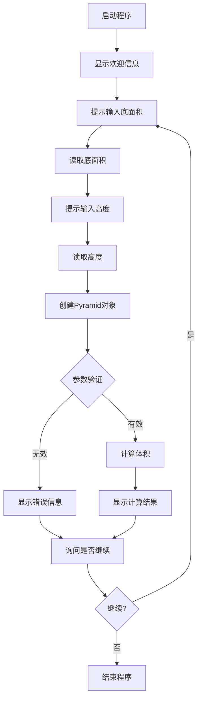

# 三棱锥体积计算程序设计

## 1. 功能概述

设计一个简洁实用的三棱锥体积计算程序，用户输入底面积和高度，程序计算并输出三棱锥的体积。

## 2. 核心功能

- 接收底面三角形的面积
- 接收三棱锥的高度
- 验证输入参数的有效性
- 计算三棱锥的体积
- 格式化输出计算结果

## 3. 数学原理

### 3.1 体积公式
三棱锥体积 = (1/3) × 底面积 × 高

其中：
- 底面积：底面三角形的面积
- 高：从顶点到底面的垂直距离

### 3.2 参数约束
- 底面积必须大于0
- 高度必须大于0

## 4. 系统设计

### 4.1 类设计

#### 4.1.1 Pyramid 类
三棱锥实体类，封装三棱锥的属性和计算逻辑

| 属性 | 类型 | 说明 |
|------|------|------|
| baseArea | double | 底面积 |
| height | double | 高度 |

| 方法 | 说明 |
|------|------|
| 构造方法(baseArea, height) | 初始化三棱锥，验证参数有效性 |
| getBaseArea() | 获取底面积 |
| setBaseArea(baseArea) | 设置底面积，验证必须大于0 |
| getHeight() | 获取高度 |
| setHeight(height) | 设置高度，验证必须大于0 |
| calculateVolume() | 计算并返回体积 |
| toString() | 返回格式化的字符串表示 |

#### 4.1.2 PyramidVolumeCalculator 类
主程序类，提供交互式命令行界面

| 方法 | 说明 |
|------|------|
| main(String[] args) | 程序入口，处理用户交互 |
| calculateVolume(baseArea, height) | 静态方法，快速计算体积 |
| demonstrateExamples() | 演示计算示例 |

### 4.2 程序流程



## 5. 输入输出设计

### 5.1 交互式输入
程序通过Scanner从控制台读取用户输入：
- 提示用户输入底面积
- 提示用户输入高度
- 支持循环计算，用户可选择继续或退出

### 5.2 输入示例
```
请输入底面积 (S): 12.0
请输入高度 (h): 5.0
```

### 5.3 输出示例
```
--- 计算结果 ---
底面积: 12.00
高度: 5.00
体积: 20.00
----------------
```

## 6. 异常处理

### 6.1 参数验证异常

| 异常情况 | 异常类型 | 错误信息 |
|----------|----------|----------|
| 底面积 ≤ 0 | IllegalArgumentException | "底面积必须大于0" |
| 高度 ≤ 0 | IllegalArgumentException | "高度必须大于0" |
| 输入非数字 | InputMismatchException | "输入错误，请输入有效的数字!" |

### 6.2 异常处理策略
- 参数验证在构造方法和setter方法中进行
- 主程序捕获异常并提示用户重新输入
- 输入错误时清除Scanner缓冲区
- 异常不会导致程序崩溃，用户可继续操作

## 7. 技术规范

### 7.1 开发环境
- Java版本：OpenJDK 11或更高版本
- 构建工具：Maven
- 包名：com.square

### 7.2 代码规范
- 遵循Java命名规范（驼峰命名法）
- 提供完整的JavaDoc注释
- 每个public方法必须进行参数校验
- 使用final修饰不可变的局部变量
- 输出结果保留两位小数

### 7.3 类文件组织
- Pyramid.java：位于 src/main/java/com/square/
- PyramidVolumeCalculator.java：位于 src/main/java/com/square/

## 8. 设计参考

本设计参考了项目中Cone类的设计风格：
- 简洁的属性封装
- 清晰的参数验证
- 友好的交互界面
- 完善的异常处理
- 支持循环计算
