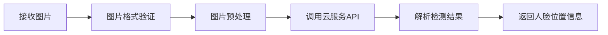
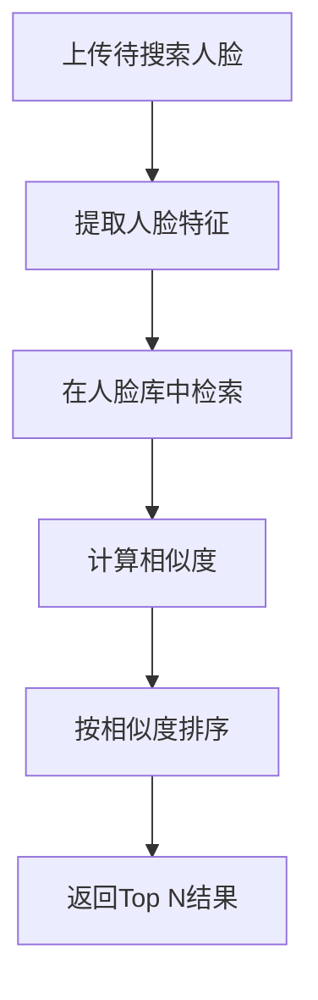
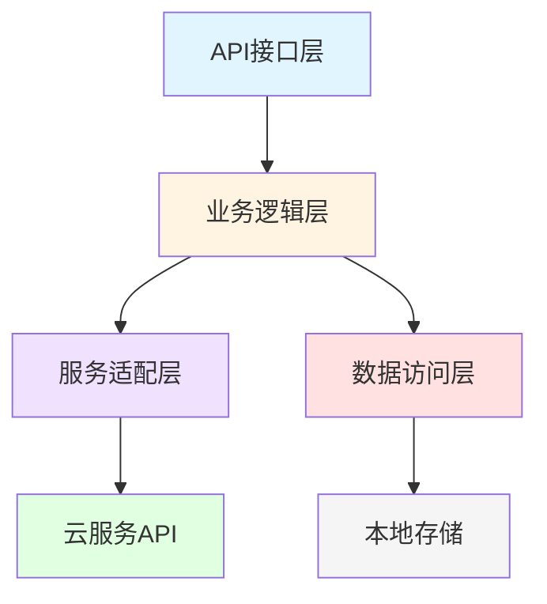
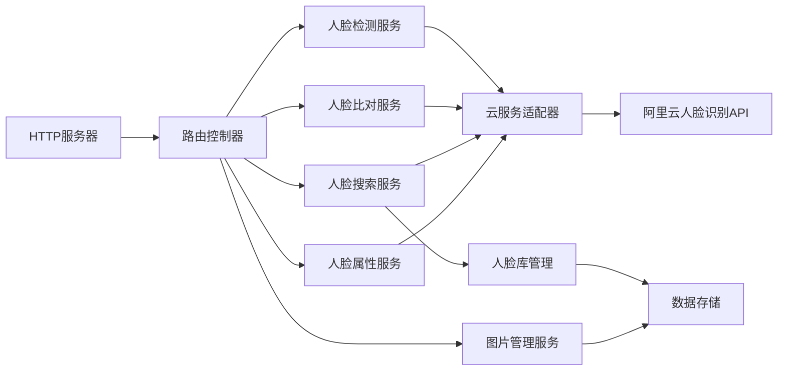
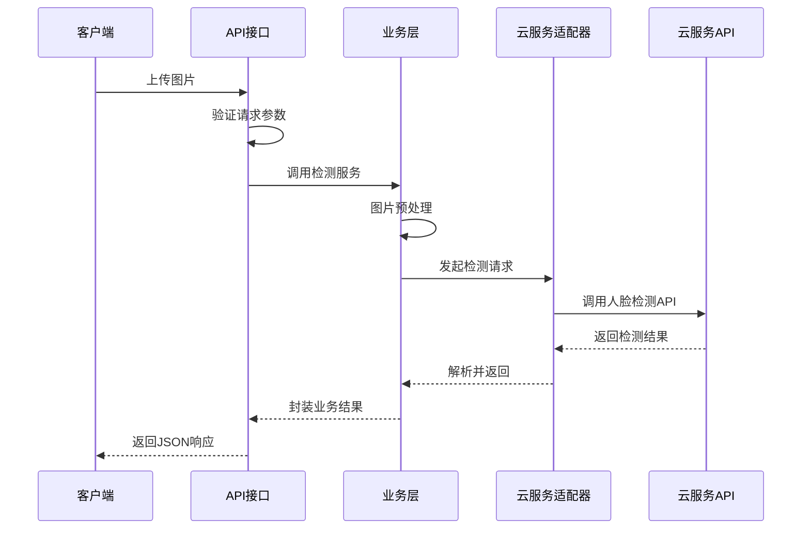
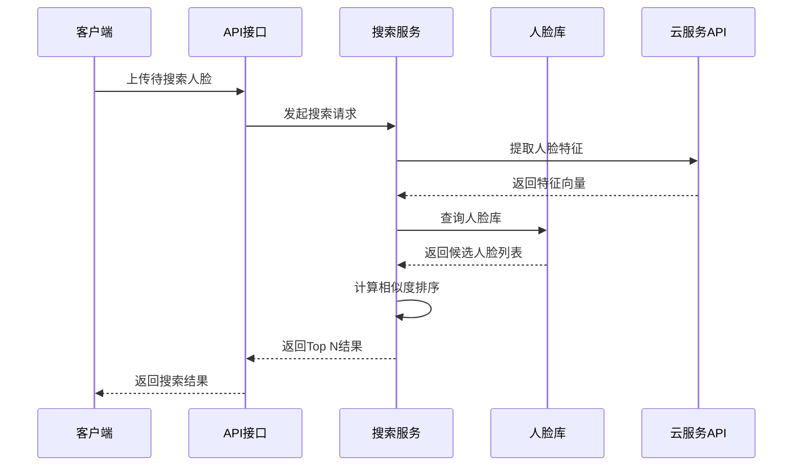

# 图片人脸识别系统设计文档

## 一、系统概述

基于阿里云API的轻量级人脸识别工具，集成到现有Go项目，支持人脸检测、比对、搜索和属性分析。

**应用场景**：个人照片管理、人脸验证、属性分析、人脸搜索

## 二、功能设计

### 2.1 核心功能模块

#### 2.1.1 人脸检测模块

**功能描述**：从上传的图片中检测人脸位置和数量

**输入**：
- 图片文件（支持JPG、PNG等常见格式）
- 图片URL地址
- Base64编码的图片数据

**输出**：
- 人脸数量
- 每个人脸的位置坐标（矩形框）
- 人脸置信度分数

**处理流程**：

#### 2.1.2 人脸特征提取模块

**功能描述**：提取人脸的特征向量，用于后续比对和识别

**输入**：
- 包含人脸的图片
- 人脸位置信息（可选，若无则自动检测）

**输出**：
- 人脸特征向量（128维或512维浮点数组）
- 特征提取置信度

**关键设计**：
- 特征向量采用标准化存储格式
- 支持批量提取多个人脸特征
- 特征数据可持久化存储

#### 2.1.3 人脸比对模块

**功能描述**：比对两张人脸的相似度

**输入**：
- 两张待比对的人脸图片
- 或两个人脸特征向量

**输出**：
- 相似度分数（0-100）
- 是否为同一人的判断结果
- 置信度水平

**比对策略**：

| 相似度分数 | 判断结果 | 置信度 | 建议动作 |
|-----------|---------|--------|---------|
| 90-100 | 同一人 | 高 | 直接通过 |
| 75-89 | 可能同一人 | 中 | 需人工确认 |
| 60-74 | 可能不同人 | 低 | 建议拒绝 |
| 0-59 | 不同人 | 高 | 直接拒绝 |

#### 2.1.4 人脸属性分析模块

**功能描述**：分析人脸的各项属性特征

**可识别属性**：

| 属性类别 | 属性值 | 说明 |
|---------|--------|------|
| 年龄 | 数值范围 | 估算年龄段 |
| 性别 | 男/女 | 性别识别 |
| 表情 | 微笑/中性/悲伤等 | 表情分类 |
| 眼镜 | 有/无 | 是否佩戴眼镜 |
| 口罩 | 有/无 | 是否佩戴口罩 |
| 人脸质量 | 0-100分 | 图片质量评分 |

**输出格式**：
- 结构化的属性数据
- 每个属性的置信度
- 综合质量评估

#### 2.1.5 人脸搜索模块

**功能描述**：在人脸库中搜索与目标人脸最相似的记录

**输入**：
- 待搜索的人脸图片
- 搜索范围（可指定人脸库分组）
- 返回数量限制（Top N）

**输出**：
- 最相似的N个人脸记录
- 每个记录的相似度分数
- 关联的用户信息

**搜索流程**：

### 2.2 辅助功能模块

#### 2.2.1 图片管理模块

**功能**：
- 图片上传和存储
- 图片格式转换
- 图片大小调整
- 图片质量检测

**存储策略**：
- 原始图片存储：保留用户上传的原图
- 缩略图生成：生成标准尺寸的缩略图用于快速展示
- 临时文件清理：定期清理过期的临时文件

#### 2.2.2 人脸库管理模块

**功能**：
- 创建和删除人脸库
- 添加和删除人脸记录
- 更新人脸信息
- 人脸库分组管理

**数据结构**：

| 字段名 | 类型 | 说明 |
|-------|------|------|
| face_id | 字符串 | 人脸唯一标识 |
| user_id | 字符串 | 关联的用户ID |
| feature_vector | 浮点数组 | 人脸特征向量 |
| face_image_url | 字符串 | 人脸图片地址 |
| group_id | 字符串 | 所属分组ID |
| created_at | 时间戳 | 创建时间 |
| updated_at | 时间戳 | 更新时间 |
| metadata | JSON对象 | 扩展元数据 |

#### 2.2.3 配置管理模块

**配置项**：

| 配置项 | 说明 | 默认值 |
|-------|------|--------|
| API_PROVIDER | 云服务提供商 | 阿里云 |
| API_KEY | API访问密钥 | 环境变量 |
| API_SECRET | API密钥 | 环境变量 |
| API_ENDPOINT | API服务地址 | 提供商默认地址 |
| MAX_IMAGE_SIZE | 最大图片大小 | 10MB |
| SUPPORTED_FORMATS | 支持的图片格式 | JPG,PNG,BMP |
| FACE_MIN_SIZE | 最小人脸尺寸 | 100x100像素 |
| SIMILARITY_THRESHOLD | 相似度阈值 | 80 |
| CACHE_ENABLED | 是否启用缓存 | true |
| CACHE_TTL | 缓存过期时间 | 3600秒 |

## 三、系统架构设计

### 3.1 整体架构

系统采用分层架构设计，从上至下分为：

**各层职责**：

| 层级 | 职责 | 关键组件 |
|-----|------|---------|
| API接口层 | 提供RESTful API，处理HTTP请求 | HTTP路由、请求验证、响应封装 |
| 业务逻辑层 | 实现核心业务功能，编排服务调用 | 人脸检测服务、比对服务、搜索服务 |
| 服务适配层 | 封装云服务API调用，屏蔽差异 | API客户端、请求转换、响应解析 |
| 数据访问层 | 管理本地数据持久化 | 人脸库DAO、图片存储、缓存管理 |

### 3.2 模块关系图

### 3.3 核心流程设计

#### 3.3.1 人脸检测流程

#### 3.3.2 人脸搜索流程

## 四、数据模型

### 4.1 人脸记录表
存储人脸ID、用户ID、特征向量、图片路径、分组、属性（年龄/性别等）、时间戳。

### 4.2 人脸分组表
存储分组ID、名称、描述、人脸数量、时间戳。

## 五、API接口

| 接口 | 方法 | 路径 | 说明 |
|-----|------|------|------|
| 人脸检测 | POST | /api/face/detect | 上传图片检测人脸 |
| 人脸比对 | POST | /api/face/compare | 比对两张人脸相似度 |
| 人脸搜索 | POST | /api/face/search | 搜索人脸库 |
| 添加人脸 | POST | /api/face/add | 添加人脸到库 |
| 删除人脸 | DELETE | /api/face/{id} | 删除指定人脸 |
| 属性分析 | POST | /api/face/analyze | 分析人脸属性 |

## 六、集成到Go项目

### 6.1 目录结构
在`server/`下新增`face/`模块，包含handlers、services、adapters、models、repository子目录。

### 6.2 环境配置
新增环境变量：FACE_API_KEY、FACE_API_SECRET、FACE_API_REGION、FACE_STORAGE_PATH、FACE_SIMILARITY_THRESHOLD等。

### 6.3 中间件复用
复用现有请求ID、日志、错误处理、CORS中间件。

## 七、云服务选型

使用阿里云人脸识别服务，按量付费，提供免费额度。通过适配器模式封装，支持未来扩展其他云服务。

## 八、非功能性设计

**性能**：检测<500ms，比对<300ms，搜索<1s，支持10 QPS。采用缓存、连接池优化。

**可靠性**：API调用重试3次，30秒超时，错误日志记录。

**安全性**：API密钥环境变量存储，图片格式大小验证，访问限流，数据加密，HTTPS通信。

**可扩展性**：适配器模式支持多云服务，支持多种存储和数据库。

## 九、错误处理

定义标准错误码：参数错误(40001)、格式错误(40002)、未检测到人脸(40004)、认证失败(40101)、云服务异常(50001)等。

统一错误响应格式包含：success、error（code/message/details）、request_id。

## 十、测试策略

**单元测试**：图片处理、云服务适配器、人脸库管理、相似度计算。

**集成测试**：完整流程测试、多人脸处理、错误场景、并发测试。

**测试数据**：准备正面照、多人照、侧脸照、低质量图片、无人脸图片。

## 十一、部署说明

**环境准备**：Go 1.21+、阿里云账号、API密钥。

**配置步骤**：复制.env模板，配置API密钥和存储路径，创建存储目录。

**启动**：作为现有Go服务的一部分启动，通过健康检查验证。

## 十二、使用场景

**人脸检测**：上传图片，返回人脸数量和位置坐标。

**人脸注册与搜索**：添加人脸到库，搜索时返回最相似记录及分数。

**人脸比对**：上传两张照片，返回相似度分数和同一人判断。

## 十三、后续优化

**功能增强**：活体检测、证件识别、人脸追踪、表情识别。

**性能优化**：Redis缓存、批量处理、向量数据库、CDN加速。

**体验优化**：Web管理界面、实时预览、批量导入、统计报表。

## 十四、风险与对策

**技术风险**：云服务API变更（适配器隔离）、API超限（限流）、网络不稳定（重试）。

**成本风险**：API费用超预期（调用上限告警）、存储占用大（定期清理）。

**安全风险**：密钥泄露（环境变量+定期更换）、数据泄露（加密存储）、恶意攻击（限流控制）。

---

**设计版本**：v1.0
