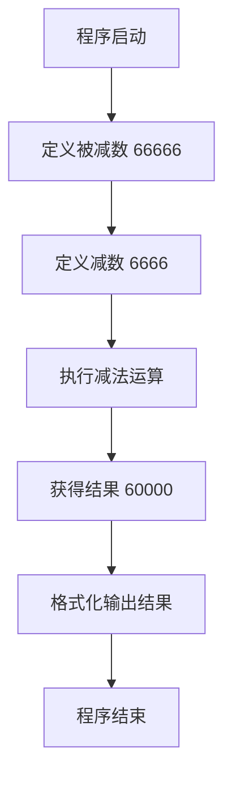

# 减法计算程序设计文档

## 一、需求概述

设计并实现一个计算 66666 - 6666 结果的程序，使用 Go 语言开发，提供命令行工具形式的独立计算程序。

## 二、功能设计

### 2.1 核心功能

程序需要实现以下功能：
- 执行固定的减法运算：66666 - 6666
- 输出计算结果：60000
- 提供清晰的命令行输出格式

### 2.2 功能范围

本程序专注于完成特定的减法计算任务，不涉及：
- 用户输入处理
- 通用减法运算能力
- 网络通信或API服务

## 三、技术方案

### 3.1 技术栈选型

| 技术项 | 选型 | 说明 |
|--------|------|------|
| 编程语言 | Go 1.21+ | 与项目现有技术栈保持一致 |
| 依赖管理 | Go Modules | 使用项目现有的 go.mod 管理 |
| 构建工具 | Go 标准工具链 | 使用 go build 编译 |

### 3.2 程序结构设计

程序采用简单的单文件结构：
- 独立的 Go 程序文件
- 包含 main 函数作为程序入口
- 执行减法运算并输出结果

### 3.3 计算逻辑设计

计算流程如下：

## 四、输出设计

### 4.1 输出格式

程序执行后应产生清晰易读的输出，包含：
- 运算表达式的展示
- 计算结果的展示
- 适当的格式化和说明文字

### 4.2 输出示例

程序运行时的预期输出效果：
- 显示完整的计算过程
- 明确标识最终结果
- 确保输出信息的可读性

## 五、部署运行

### 5.1 程序位置

建议将程序文件放置在项目根目录下的独立目录或与现有结构协调的位置。

### 5.2 编译方式

程序应支持标准的 Go 编译流程：
- 使用 go build 命令进行编译
- 生成可执行的二进制文件
- 支持跨平台编译

### 5.3 执行方式

编译完成后：
- 直接运行生成的可执行文件
- 无需额外的运行时参数
- 立即输出计算结果

## 六、质量保证

### 6.1 准确性保证

- 确保减法运算的数学准确性
- 验证输出结果为 60000

### 6.2 代码质量

- 遵循 Go 语言编码规范
- 保持简洁清晰的实现
- 添加必要的注释说明

## 七、扩展性考虑

虽然当前需求仅为计算固定值，但设计上预留以下扩展可能：
- 未来可扩展为支持命令行参数输入
- 可改造为通用减法计算器
- 可集成到现有的客户端-服务器架构中作为计算服务
