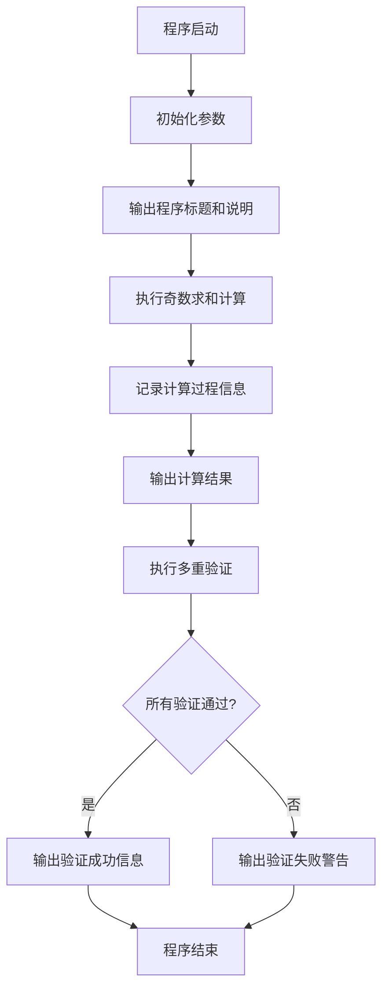
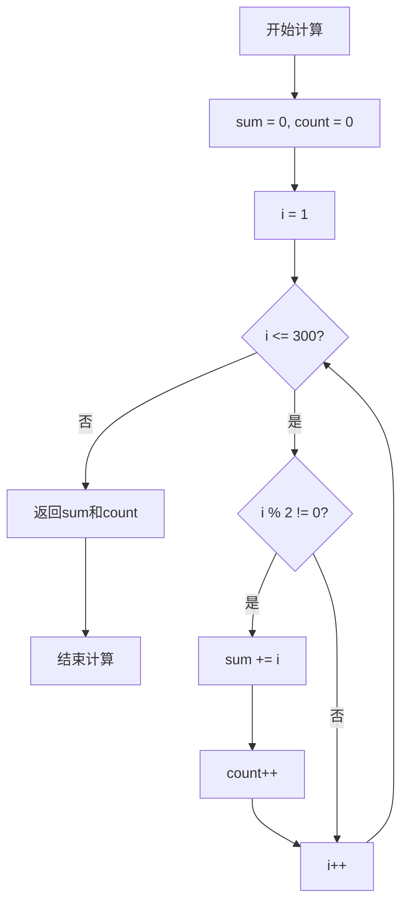
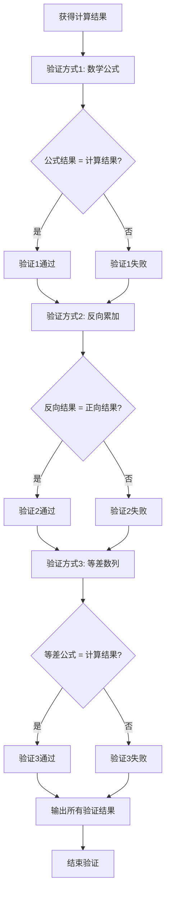

# 验证300以内的奇数求和程序设计文档

## 1. 功能概述

本程序的核心目标是计算并验证300以内所有奇数的求和结果。系统将实现奇数识别、累加计算、结果验证三大核心功能，确保计算的准确性和可靠性。

## 2. 业务需求

### 2.1 核心需求

- 识别1到300范围内的所有奇数
- 对所有奇数进行求和运算
- 通过多种方式验证计算结果的正确性
- 清晰展示计算过程和最终结果

### 2.2 功能边界

- 数值范围：1 至 300（包含边界值）
- 奇数定义：不能被2整除的正整数
- 输出要求：包含计算过程、验证过程和最终结果

## 3. 系统设计

### 3.1 程序结构

程序采用单一主类设计，包含以下核心组件：

- 主程序入口：负责协调各个计算和验证流程
- 奇数求和计算器：实现奇数识别和累加逻辑
- 结果验证器：通过多种算法验证计算正确性
- 输出格式化器：规范化输出计算过程和结果

### 3.2 数据模型

| 数据项 | 类型 | 说明 | 取值范围 |
|--------|------|------|----------|
| 上限值 | 整数 | 计算范围的上限 | 300 |
| 当前数 | 整数 | 遍历过程中的当前数值 | 1-300 |
| 累加和 | 整数 | 奇数累加的结果 | 正整数 |
| 奇数计数 | 整数 | 统计奇数的个数 | 正整数 |

### 3.3 核心算法设计

#### 3.3.1 奇数求和算法

算法采用迭代遍历方式实现：

1. 初始化累加器为0，计数器为0
2. 从1开始遍历到300
3. 对每个数执行奇偶性判断（取模运算）
4. 若为奇数，则累加到求和结果，并增加计数
5. 遍历结束后返回累加和与奇数个数

**时间复杂度**：O(n)，其中n为上限值300  
**空间复杂度**：O(1)

#### 3.3.2 结果验证算法

采用多重验证策略确保计算准确性：

**验证方式一：数学公式验证**
- 原理：奇数数列求和公式 = n²（n为奇数个数）
- 计算1到300内奇数个数
- 应用等差数列求和公式验证

**验证方式二：反向累加验证**
- 从300开始向1反向遍历
- 识别奇数并累加
- 对比正向和反向计算结果

**验证方式三：数学性质验证**
- 验证首项（1）和末项（299）
- 验证奇数个数是否为150
- 应用等差数列性质：和 = (首项 + 末项) × 项数 ÷ 2

### 3.4 处理流程



### 3.5 计算流程详解



### 3.6 验证流程设计



## 4. 输出设计

### 4.1 输出内容规范

| 输出项 | 说明 | 示例 |
|--------|------|------|
| 程序标题 | 标识程序功能 | "300以内奇数求和验证程序" |
| 计算范围 | 明确数值范围 | "计算范围: 1 ~ 300" |
| 奇数个数 | 统计奇数数量 | "奇数个数: 150" |
| 首项和末项 | 显示数列边界 | "首项: 1, 末项: 299" |
| 求和结果 | 最终计算结果 | "奇数求和结果: 22500" |
| 验证过程 | 各验证方法详情 | "验证方式1: 公式法 - 结果: 22500 [通过]" |
| 验证结论 | 综合验证结果 | "所有验证通过，计算结果正确" |

### 4.2 输出格式示例

```
==================================================
300以内奇数求和验证程序
==================================================

【计算信息】
计算范围: 1 ~ 300
奇数个数: 150
首项: 1
末项: 299

【计算结果】
奇数求和结果: 22500

==================================================
【验证过程】
==================================================

验证方式1 - 数学公式法:
  公式: n² (n为奇数个数)
  计算: 150 × 150 = 22500
  结果: 通过 ✓

验证方式2 - 反向累加法:
  反向遍历求和: 22500
  结果: 通过 ✓

验证方式3 - 等差数列公式:
  公式: (首项 + 末项) × 项数 ÷ 2
  计算: (1 + 299) × 150 ÷ 2 = 22500
  结果: 通过 ✓

==================================================
【验证结论】
所有验证通过，计算结果正确！
==================================================
```

## 5. 技术约束

### 5.1 开发环境

- 编程语言：Java
- Java版本：与项目现有环境一致（Java 21）
- 包路径：com.square

### 5.2 编码规范

- 遵循项目现有代码风格
- 类名采用驼峰命名法
- 方法名使用动词开头的驼峰命名
- 常量使用全大写加下划线分隔
- 提供充分的注释说明

### 5.3 性能要求

- 计算时间应在毫秒级完成
- 内存占用最小化，避免不必要的对象创建
- 使用基本数据类型进行计算

## 6. 质量保证

### 6.1 正确性保证

- 通过三种独立的验证算法交叉验证
- 每种验证方法基于不同数学原理
- 所有验证结果必须一致才判定为正确

### 6.2 可靠性保证

- 使用整数运算避免浮点误差
- 处理边界情况（1和300）
- 确保不会出现整数溢出

### 6.3 可维护性保证

- 方法职责单一，便于理解和修改
- 魔法数字使用常量定义
- 代码结构清晰，逻辑流程明确

## 7. 预期数学结果

### 7.1 理论计算

- 奇数个数：(300 - 1) ÷ 2 + 1 = 150
- 首项：1
- 末项：299
- 求和公式：(1 + 299) × 150 ÷ 2 = 22500

### 7.2 验证基准

所有计算方法的结果应等于：**22500**

## 8. 扩展性考虑

虽然当前需求固定为300，但设计应便于未来扩展：

- 上限值可配置化（通过常量或参数）
- 验证方法可独立调用
- 便于添加新的验证策略
- 支持不同的输出格式
